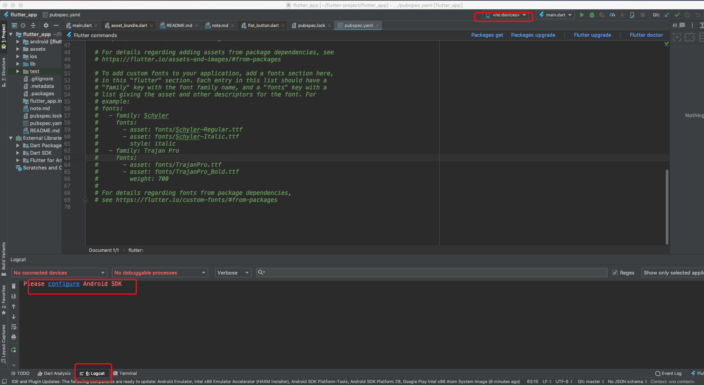
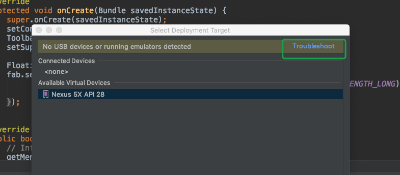
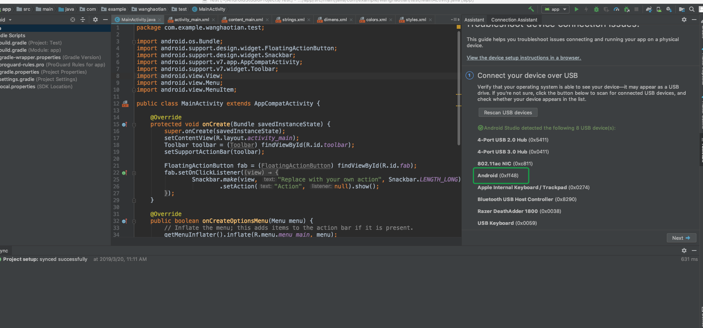
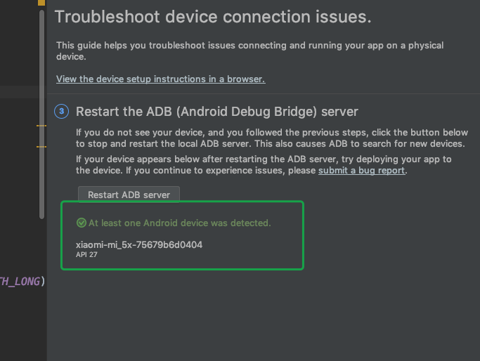

# 问题和解决方式

## 问题： Android Studio 突然找不到模拟器，Logcat提示 `Please config Android SDK`

描述：之前sdk是配置好的，查看配置后发现路径也没问题，有点莫名奇妙，难道是电脑系统更新的原因？

解决方案：我尝试者启动了一遍之前的Android原生项目，启动成功后，我又启动了下flutter项目，发现好了···

## 真机调试

### Troubleshot故障检修

打开或者新建一个普通的android项目，然后点右上角的debug按钮，会出现选择设备的列表（如果没有请修改config中的 deployment target options 中的target为“open select deployment target dialog”）
然后点击Troubleshot

### 查看手机是否已经连接

### 查看手机是否是开发者模式且允许usb调试

如果开启了会在此显示设备（没开启会有红色字样 No Android devices detected. ）

> 1. 手机一定要开启开发者模式，不同android版本或者手机方法不同
> 2. 电脑和数据先相连后，一定要点允许USB调试
